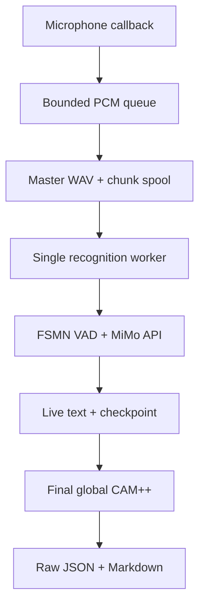

# Live recording and transcription

[English](live-transcription.md) | [简体中文](live-transcription.zh-CN.md)

`audio-transcriber-live` records a microphone to a durable 16 kHz mono WAV and
incrementally recognizes speech through the Xiaomi MiMo HTTP API. It is
designed for meetings where preserving the recording and stable output order
matter more than minimizing latency at any cost.

## Command

```bash
# Inspect microphone indices/names first.
audio-transcriber-live --list-devices

export MIMO_API_KEY='...'

audio-transcriber-live \
  --name weekly-meeting \
  --output-dir ./transcripts \
  --input-device 0 \
  --chunk-seconds 15 \
  --mimo-audio-tag '<auto>' \
  --device cpu \
  --num-speakers 4 \
  --speakers '张三,李四,王五,赵六'
```

Press `Ctrl+C` for a graceful stop. For unattended capture, pass a positive
`--duration` in seconds. A selected output stem is never replaced unless
`--overwrite` is explicit.

The MiMo API configuration is identical to the offline command:

| CLI option | Environment | Default |
|---|---|---|
| `--mimo-api-base-url` | `MIMO_BASE_URL` | `https://api.xiaomimimo.com/v1` |
| `--mimo-api-model` | `MIMO_API_MODEL` | `mimo-v2.5-asr` |
| `--mimo-api-key-env NAME` | Reads `NAME` | `MIMO_API_KEY` |
| `--mimo-api-timeout` | — | `120` seconds |

CLI values override environment values. The key itself must stay in an
environment variable.

## Data flow



The microphone callback only copies PCM into a bounded queue. It never loads a
model, waits for HTTP, or writes JSON. The foreground recorder drains the queue
to the master WAV and emits disk-backed chunks. One worker consumes those
chunks serially, which preserves timestamps and prevents accidental API
concurrency.

If the capture queue overflows or the audio driver reports dropped input, the
session stops with an error instead of silently producing a recording with a
hidden gap.

## Chunk boundaries and latency

The default spool interval is 15 seconds. FSMN VAD runs on each window using a
model loaded before microphone capture begins. When the last speech interval
touches the right edge, its PCM is carried into the next window and VAD runs
again on the combined audio. This reduces mid-word cuts without overlapping
API submissions or requiring text deduplication.

`--boundary-guard-ms` controls how close speech may be to the edge before it is
carried. `--max-pending-seconds` bounds the carry buffer; continuous speech
beyond that limit is force-split so memory and preview latency stay finite.

Expected preview latency is approximately:

```text
chunk interval + VAD time + MiMo API time + any finite retry backoff
```

This is near-real-time chunked recognition. Xiaomi's request/response
`input_audio` API is not treated as a bidirectional streaming protocol.

## Speaker handling

Live lines contain timestamps and text but no provisional speaker names.
Per-window clustering would assign unrelated numeric labels in different
windows, causing visible speaker changes. After capture ends, the tool runs
CAM++ once against every recognized interval in the complete master WAV, then
writes the normal unified shape:

```json
{
  "speaker": 0,
  "start_ms": 1000,
  "end_ms": 5000,
  "text": "测试文本"
}
```

`--num-speakers` is the CAM++ clustering count. If `--speakers` is supplied
without it, the number of comma-separated names becomes the count. Without
either option, all segments use speaker `0`.

## Files and failure recovery

For `--name weekly-meeting`, the tool creates:

| File | Purpose |
|---|---|
| `weekly-meeting.wav` | Complete microphone recording |
| `weekly-meeting_live_chunks/chunk_*.wav` | Durable work queue |
| `weekly-meeting_live_partial.json` | Backend/config/progress checkpoint |
| `weekly-meeting_raw_transcript.json` | Final diarized segments |
| `weekly-meeting-transcript.md` | Final readable transcript |

Chunk files are deleted only after successful finalization unless
`--keep-chunks` is used. On capture, API, VAD, or CAM++ failure, the WAV,
chunks, and checkpoint remain.

The live checkpoint records the API backend, model, base URL, audio tag,
completed chunk indices, segments, and failure location. It never records the
API key. A failed live session can always be recovered from its master WAV
with the offline pipeline:

```bash
audio-transcriber transcripts/weekly-meeting.wav \
  --lang mimo \
  --mimo-backend api \
  --mimo-audio-tag '<auto>' \
  --device cpu \
  --num-speakers 4 \
  --speakers '张三,李四,王五,赵六'
```

That recovery intentionally re-runs recognition from the WAV. Replaying only
the last spool file is unsafe because a VAD speech interval may have been
carried across several chunk boundaries.

To run optional LLM cleanup after live finalization, reuse its raw JSON:

```bash
audio-transcriber transcripts/weekly-meeting.wav \
  --skip-transcribe \
  --json-out transcripts/weekly-meeting_raw_transcript.json \
  --output transcripts/weekly-meeting-cleaned.md \
  --speakers '张三,李四,王五,赵六' \
  --model your-model \
  --provider openai
```

## Dependencies

The Python `sounddevice` package is installed by `scripts/setup_env.sh`.
PortAudio must also exist on the host:

```bash
# Debian/Ubuntu
sudo apt-get install libportaudio2

# macOS
brew install portaudio
```

FSMN VAD and final CAM++ still require the base FunASR, ModelScope, PyTorch,
soundfile, and scikit-learn environment. MiMo weights, FlashAttention, and an
NVIDIA GPU are not needed for API mode; use `--device cpu` when appropriate.

## Current limitations

- Only the Xiaomi MiMo HTTP API is supported by the live command. Local MiMo
  and FunASR remain offline commands.
- One mono input device is recorded per process.
- Speaker labels become available only during finalization.
- There is no in-place live-checkpoint resume command. Recovery reprocesses the
  preserved master WAV so carried VAD context cannot be lost.
- Final LLM cleanup is a separate offline step.
