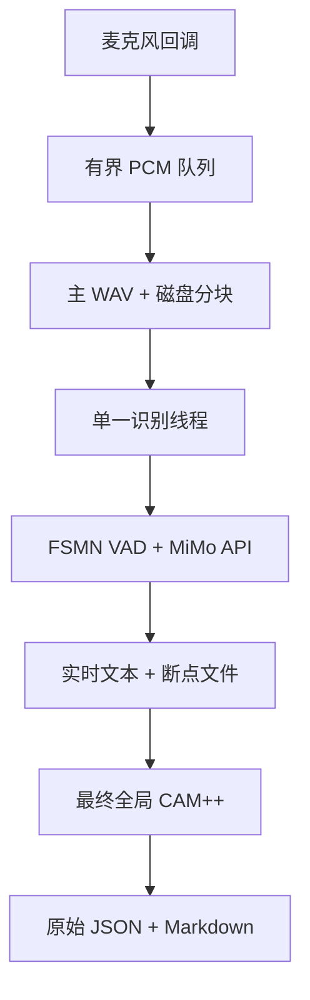

# 分块式近实时录音与转录

[English](live-transcription.md) | [简体中文](live-transcription.zh-CN.md)

`audio-transcriber-live` 会将麦克风音频持续保存为可靠的 16 kHz 单声道 WAV，并通过小米 MiMo HTTP API 增量识别语音。该模式主要面向会议场景，设计重点是完整保存录音、保持输出顺序稳定，并在网络波动时避免阻塞音频采集。

## 使用命令

```bash
# 先查看麦克风编号和名称
audio-transcriber-live --list-devices

export MIMO_API_KEY='...'

audio-transcriber-live \
  --name weekly-meeting \
  --output-dir ./transcripts \
  --input-device 0 \
  --chunk-seconds 15 \
  --mimo-audio-tag '<auto>' \
  --device cpu \
  --num-speakers 4 \
  --speakers '张三,李四,王五,赵六'
```

按 `Ctrl+C` 可正常结束录制；无人值守时，可以用正数 `--duration` 指定秒数。除非显式传入 `--overwrite`，程序不会覆盖相同名称的已有输出。

MiMo API 配置与离线命令保持一致：

| 命令行参数 | 环境变量 | 默认值 |
|---|---|---|
| `--mimo-api-base-url` | `MIMO_BASE_URL` | `https://api.xiaomimimo.com/v1` |
| `--mimo-api-model` | `MIMO_API_MODEL` | `mimo-v2.5-asr` |
| `--mimo-api-key-env NAME` | 读取 `NAME` | `MIMO_API_KEY` |
| `--mimo-api-timeout` | — | `120` 秒 |
| `--mimo-api-max-audio-mb` | `MIMO_API_MAX_AUDIO_MB` | `20` |
| `--mimo-api-allow-reasoning-content` | `MIMO_API_ALLOW_REASONING_CONTENT` | 关闭 |

命令行值优先于环境变量。API Key 必须保存在环境变量中。

默认只接受 `message.content` 作为转录文本。由于
`reasoning_content` 可能包含模型分析，只有显式启用兼容开关时才会回退。
协议要求的 Base64 Data URL 会从有界文件读取中编码；原始 WAV 超过配置
上限时会在发送前拒绝。

## 数据流



麦克风回调只负责把 PCM 复制到有界队列，不会加载模型、等待 HTTP 请求或写入 JSON。前台录制器不断清空队列，将数据写入主 WAV，并生成保存在磁盘上的工作分块。单一工作线程按顺序消费分块，从而保持时间戳顺序，并防止意外并发调用 API。

如果采集队列溢出，或者音频驱动报告输入数据丢失，当前会话会明确报错并停止，避免生成带有隐蔽缺口的录音。

## 分块边界和延迟

默认分块间隔为 15 秒。FSMN VAD 模型会在开始麦克风采集前完成加载，随后对每个窗口执行 VAD。如果最后一个语音段触及窗口右边界，其 PCM 会保留到下一窗口，并在合并后的音频上重新运行 VAD。这种方式可以降低单词或句子在固定时间点被截断的概率，同时不需要重叠提交 API 请求，也不需要对重复文本进行去重。

`--boundary-guard-ms` 控制距离右边界多近的语音需要保留。`--max-pending-seconds` 限制最大待处理语音长度；连续说话超过该限制时会强制切分，以控制内存占用和预览延迟。

预览延迟大致为：

```text
分块时长 + VAD 耗时 + MiMo API 耗时 + 有限重试退避时间
```

该功能属于分块式近实时识别。小米的 `input_audio` 请求/响应接口不会被当作双向流式协议使用。

## 说话人处理

实时输出包含时间戳和文本，但不会显示临时说话人姓名。若每个窗口分别聚类，不同窗口中的数字标签之间没有稳定对应关系，会导致同一个人在预览中不断更换编号。录制结束后，程序会针对完整主 WAV 中的所有已识别语音段统一执行一次 CAM++，然后生成标准结构：

```json
{
  "speaker": 0,
  "start_ms": 1000,
  "end_ms": 5000,
  "text": "测试文本"
}
```

`--num-speakers` 指定 CAM++ 聚类数量。如果只提供 `--speakers`，逗号分隔姓名的数量会自动成为说话人数。如果两者都未提供，所有分段使用说话人 `0`。

## 文件与故障恢复

使用 `--name weekly-meeting` 时会生成：

| 文件 | 用途 |
|---|---|
| `weekly-meeting.wav` | 完整麦克风录音 |
| `weekly-meeting_live_chunks/chunk_*.wav` | 持久化工作队列 |
| `weekly-meeting_live_partial.json` | 后端、配置和进度断点 |
| `weekly-meeting_live_journal.jsonl` | 每次 fsync 的追加式会话事件 |
| `weekly-meeting_raw_transcript.json` | 最终说话人分离结果 |
| `weekly-meeting-transcript.md` | 最终可读转录稿 |

只有成功完成最终处理后，分块文件才会被删除；使用 `--keep-chunks` 可始终保留。录音、API、VAD 或 CAM++ 阶段失败时，WAV、分块和断点文件都会保留。

实时断点文件记录 API 后端、模型、Base URL、音频标签、已完成分块编号、识别分段和失败位置。JSONL 日志会逐条持久记录会话开始、已落盘分块、识别进度、失败和完成事件。两者都不会记录 API Key。
会话文件按相对于断点目录的路径保存，因此恢复不依赖当前工作目录，整个会话
目录也可以一起移动。journal 追加由锁串行化；journal 记录和原子替换的断点
都会对文件及父目录执行 fsync。

使用专用恢复入口即可恢复；该命令不会初始化或访问麦克风：

```bash
audio-transcriber-live \
  --recover-checkpoint transcripts/weekly-meeting_live_partial.json \
  --device cpu
```

恢复时会从 WAV 重新识别。只重放最后一个分块并不安全，因为一个 VAD 语音段可能跨越多个分块边界。

如果要在实时录制结束后运行可选的 LLM 清理，可以复用原始 JSON：

```bash
audio-transcriber transcripts/weekly-meeting.wav \
  --skip-transcribe \
  --json-out transcripts/weekly-meeting_raw_transcript.json \
  --output transcripts/weekly-meeting-cleaned.md \
  --speakers '张三,李四,王五,赵六' \
  --model your-model \
  --provider openai
```

## 依赖

`scripts/setup_env.sh` 会安装 Python `sounddevice` 包，主机仍需安装 PortAudio：

```bash
# Debian/Ubuntu
sudo apt-get install libportaudio2

# macOS
brew install portaudio
```

FSMN VAD 和最终 CAM++ 还依赖基础环境中的 FunASR、ModelScope、PyTorch、soundfile 和 scikit-learn。API 模式不需要 MiMo 权重、FlashAttention 或 NVIDIA GPU，适合时可直接使用 `--device cpu`。

## 当前限制

- 实时命令当前只支持小米 MiMo HTTP API；本地 MiMo 和 FunASR 仍通过离线命令使用。
- 每个进程只能录制一个单声道输入设备。
- 说话人标签要在最终处理阶段才会生成。
- 断点恢复会重新处理已保存的主 WAV，因此会再次消耗 API 配额，以确保不会丢失跨边界的 VAD 上下文。
- 最终 LLM 清理需要单独执行离线步骤。
